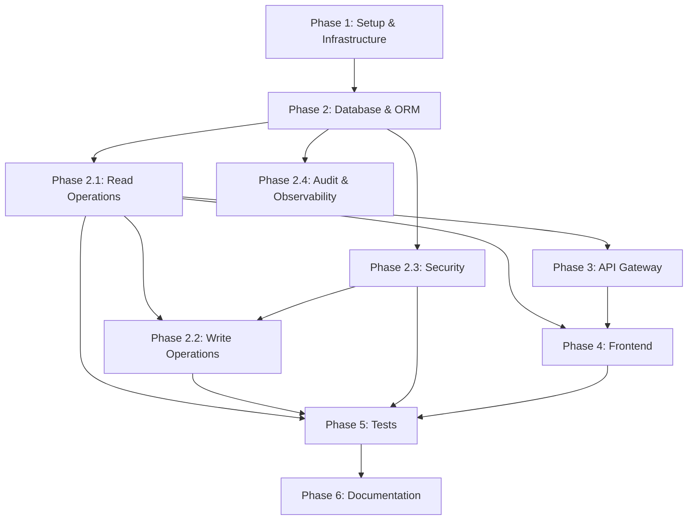

---

description: "Complete task list for Foundation Product Catalog implementation"

---

# Tasks: Catálogo de Produtos - Fundação

**Input**: Design documents from `specs/001-foundation-product-catalog/`

**Prerequisites**: plan.md ✅, spec.md ✅, research.md ✅, data-model.md ✅, contracts/ ✅, quickstart.md ✅

**Outputs**: 
- Complete Product Service microservice
- API Gateway routing and configuration
- React frontend with catalog UI
- Docker Compose local development environment
- Comprehensive test suites (backend + frontend)

**Architecture**: Hexagonal architecture, microservices, database-per-service (PostgreSQL), Spring Cloud Gateway

---

## Organization Overview

Tasks are organized into **6 major phases** with **52 total tasks**:

1. **Phase 1: Setup & Infrastructure** (6 tasks) - Project structure, Maven, Docker, configs
2. **Phase 2: Database & ORM** (8 tasks) - PostgreSQL schema, JPA entities, migrations
3. **Phase 2.1: Product Service - Read Operations** (10 tasks) - US-001 to US-006, listing, search, filters
4. **Phase 2.2: Product Service - Write Operations** (8 tasks) - US-007 to US-010, CRUD admin operations
5. **Phase 2.3: Security & Auth** (6 tasks) - US-011, JWT, Spring Security, authorization
6. **Phase 2.4: Audit & Observability** (5 tasks) - US-012, US-013, audit fields, logging, metrics
7. **Phase 3: API Gateway** (4 tasks) - Routing, JWT validation, correlation IDs
8. **Phase 4: Frontend - Catalog UI** (6 tasks) - React components, Zustand store, API integration
9. **Phase 5: Tests & Validation** (10 tasks) - Unit, integration, E2E, coverage verification
10. **Phase 6: Documentation & Delivery** (3 tasks) - README, deployment guide, cleanup

### Dependency Map

```
Phase 1 (Setup) 
  ↓
Phase 2 (Database + ORM)
  ├→ Phase 2.1 (Read Ops - BLOCKING for Frontend & Gateway)
  │   ├→ Phase 2.2 (Write Ops)
  │   │   ├→ Phase 2.3 (Security - BLOCKING for all admin ops)
  │   │   └→ Phase 2.4 (Audit & Observability)
  │
  ├→ Phase 3 (API Gateway - depends on 2.1)
  │
  └→ Phase 4 (Frontend - depends on 2.1 read endpoints)

Phase 5 (Tests) - Runs throughout phases 2-4
Phase 6 (Docs) - Final cleanup
```

### Safe Parallel Execution Groups

- **During Phase 2.1**: Frontend development can proceed independently (Phase 4)
- **During Phase 2.2-2.4**: Tests can be written and framework setup done in parallel
- **During Phase 3**: Frontend styling and component refinement can proceed
- **Within each phase**: [P] marked tasks can run in parallel

---

## Phase 1: Setup & Infrastructure

**Goal**: Establish project structure, dependencies, Docker environment, and base configurations

**Estimated Duration**: 1-2 days

**Acceptance Criteria**:
- ✅ Project structure created with Maven modules
- ✅ All dependencies declared (pom.xml files)
- ✅ Docker Compose environment runs successfully
- ✅ Basic configuration files created (.env.local, application.yml)
- ✅ CI/CD artifacts in place (Dockerfile for each service)

---

### Setup Phase Tasks

- [x] [1.1] [P] [SETUP] Create Maven multi-module project structure  
  **File**: `backend/pom.xml` (parent), `backend/api-gateway/pom.xml`, `backend/product-service/pom.xml`  
  **Details**: Parent POM with shared versions (Spring Boot 3.3.x, Java 21), module declarations, common properties

- [x] [1.2] [P] [SETUP] Create Node.js frontend project with Vite  
  **File**: `frontend/package.json`, `frontend/vite.config.ts`, `frontend/tsconfig.json`  
  **Details**: npm init with React 18, TypeScript 5, Vite 5, dev dependencies (Vitest, React Testing Library)

- [x] [1.3] [SETUP] Create Docker Compose configuration with all services  
  **File**: `docker-compose.yml`  
  **Details**: Services for postgres (15-alpine), api-gateway, product-service, frontend, with networking and environment variables

- [x] [1.4] [SETUP] Create environment configuration template (.env.example)  
  **File**: `.env.example` (copied to `.env` locally; secrets are not committed)  
  **Details**: Database credentials, JWT secret, port configurations, log levels

- [x] [1.5] [P] [SETUP] Create base Dockerfile for Product Service  
  **File**: `backend/product-service/Dockerfile`  
  **Details**: Multi-stage build, Java 21, Maven cache layer, Alpine runtime

- [x] [1.6] [P] [SETUP] Create base Dockerfile for API Gateway  
  **File**: `backend/api-gateway/Dockerfile`  
  **Details**: Multi-stage build, Java 21, Maven cache layer, Alpine runtime

---

## Phase 2: Database & ORM

**Goal**: Design and implement PostgreSQL schema, create JPA entities, establish data access layer

**Estimated Duration**: 1-2 days

**Blocking**: All subsequent phases (hard dependency on database schema and entities)

**Acceptance Criteria**:
- ✅ PostgreSQL database initialized with schema from data-model.md
- ✅ All indexes created (14 total: FTS, category hierarchy, sorting, filtering)
- ✅ JPA entities (Product, Category) created with Hibernate annotations
- ✅ Soft-delete strategy implemented (@Where clause)
- ✅ Audit fields working (@PrePersist, @PreUpdate callbacks)
- ✅ All constraints validated in database

---

### Database Phase Tasks

- [x] [2.1] [DATABASE] Create Product domain model and JPA entity with all fields and constraints  
  **File**: `backend/product-service/src/main/java/com/techstore/product/domain/Product.java`  
  **Details**: UUID id (PK), name (varchar 255), description (text), price (numeric 12,2), cost, brand, sku (unique), categoryId (FK), quantity, imageUrl, isActive, createdAt, updatedAt, createdBy, updatedBy  
  **Constraints**: @NotNull, @Min/@Max for prices/quantities, @Size for strings, unique constraints  
  **Annotations**: @Entity, @Table, @Where(clause = "is_active = true"), @PrePersist, @PreUpdate

- [x] [2.2] [DATABASE] Create Category domain model and JPA entity with hierarchy support  
  **File**: `backend/product-service/src/main/java/com/techstore/product/domain/Category.java`  
  **Details**: UUID id (PK), name (varchar 100, unique), description (varchar 500), parentCategoryId (self-referencing FK), displayOrder, isActive, audit fields  
  **Relationships**: @OneToMany to self for children, @ManyToOne to self for parent  
  **Annotations**: @Entity, @Table, @Where(clause = "is_active = true")

- [x] [2.3] [DATABASE] Create Product persistence adapter and Spring Data repository  
  **File**: `backend/product-service/src/main/java/com/techstore/product/adapter/persistence/ProductRepository.java`  
  **Details**: Spring Data JPA repository with custom query methods: findBySku, findByNameAndCategory, search by full-text  
  **Methods**: save(), findById(), findAll(Pageable), custom search methods

- [x] [2.4] [DATABASE] Create Category persistence adapter and Spring Data repository  
  **File**: `backend/product-service/src/main/java/com/techstore/product/adapter/persistence/CategoryRepository.java`  
  **Details**: Spring Data JPA repository with methods for hierarchy navigation  
  **Methods**: findByName, findByParentCategoryId, findAllByIsActiveTrue

- [x] [2.5] [DATABASE] Configure Flyway database migration  
  **File**: `backend/product-service/src/main/resources/db/migration/V1_0_0__create_schema.sql`  
  **Details**: DDL from data-model.md (CREATE TABLE for categories, products; all constraints and indexes)  
  **Includes**: All 14 indexes (GIN for FTS, category hierarchy, pricing, dates)

- [x] [2.6] [DATABASE] Configure JPA and Hibernate in Product Service  
  **File**: `backend/product-service/src/main/resources/application.yml`  
  **Details**: spring.jpa.hibernate.ddl-auto=validate, spring.jpa.properties.hibernate.dialect=PostgreSQL15Dialect, spring.jpa.show-sql, spring.jpa.properties.hibernate.format_sql

- [x] [2.7] [DATABASE] Populate creation audit fields in application use cases  
  **File**: `backend/product-service/src/main/java/com/techstore/product/application/service/`  
  **Details**: Receive user ID from the REST adapter and set createdAt/createdBy using a UTC Clock before persistence

- [x] [2.8] [DATABASE] Populate update audit fields in application use cases  
  **File**: `backend/product-service/src/main/java/com/techstore/product/application/service/`  
  **Details**: Receive user ID from the REST adapter and set updatedAt/updatedBy using a UTC Clock before persistence

---

## Phase 2.1: Product Service - Read Operations (Queries)

**Goal**: Implement all GET endpoints for product listing, search, filtering, sorting, and detail views

**Estimated Duration**: 3-4 days

**Blocks**: API Gateway (needs endpoints to route to), Frontend (needs data to display)

**Acceptance Criteria**:
- ✅ GET /api/products with pagination (default 20/page)
- ✅ Full-text search by ?query= parameter
- ✅ Filtering by ?categoryId=, ?minPrice=, ?maxPrice=, ?inStock=, ?brand=
- ✅ Sorting by ?sortBy=relevance|price|name|newest with ?sortOrder=asc|desc
- ✅ GET /api/products/{id} returns complete product details
- ✅ GET /api/categories returns all active categories
- ✅ GET /api/categories/{id} returns category details
- ✅ All queries respect soft-delete (only return isActive=true)
- ✅ Search response < 300ms p95, page load < 500ms p95
- ✅ No authentication required for read operations

---

### Product Service Read Operations Tasks

- [x] [3.1] [P2.1] Create Product API and paginated response DTOs  
  **File**: `backend/product-service/src/main/java/com/techstore/product/adapter/http/ApiModels.java`  
  **Details**: Immutable DTO with all fields (id, name, description, price, cost, brand, sku, categoryId, quantity, imageUrl, isActive, createdAt, updatedAt, timestamps)  
  **Related**: PaginatedProductsResponse, ProductListResponse, ProductDetailResponse

- [x] [3.2] [P2.1] Create Category API DTO  
  **File**: `backend/product-service/src/main/java/com/techstore/product/adapter/http/ApiModels.java`  
  **Details**: Category name, description, parentCategoryId, displayOrder, isActive, audit fields  
  **Related**: CategoryListResponse

- [x] [3.3] [P2.1] Map Product to REST response DTO  
  **File**: `backend/product-service/src/main/java/com/techstore/product/adapter/http/ApiModels.java`  
  **Details**: Explicit mapping keeps internal cost hidden from non-admin responses

- [x] [3.4] [P2.1] Map Category to REST response DTO  
  **File**: `backend/product-service/src/main/java/com/techstore/product/adapter/http/ApiModels.java`  
  **Details**: Explicit mapping without exposing persistence entities

- [x] [3.5] [P2.1] Create ProductService read/write use cases  
  **File**: `backend/product-service/src/main/java/com/techstore/product/application/service/ProductService.java`  
  **Details**: Business logic for listing, searching, filtering, sorting products  
  **Methods**:  
    - `listProducts(PageRequest, SearchFilters) → Page<Product>`  
    - `searchProducts(String query, PageRequest) → Page<Product>`  
    - `filterProducts(FilterCriteria, PageRequest) → Page<Product>`  
    - `getProductById(UUID) → Product`  
  **Behavior**: Combine all filters with AND, apply sorting, return paginated results

- [x] [3.6] [P2.1] Create CategoryService use cases  
  **File**: `backend/product-service/src/main/java/com/techstore/product/application/service/CategoryService.java`  
  **Details**: Business logic for listing and querying categories  
  **Methods**:  
    - `listAllCategories() → List<Category>`  
    - `getCategoryById(UUID) → Category`  
    - `getCategoryHierarchy() → TreeNode<Category>`  
  **Behavior**: Return only active categories by default

- [x] [3.7] [P2.1] Create ProductController with catalog and admin endpoints  
  **File**: `backend/product-service/src/main/java/com/techstore/product/adapter/http/ProductController.java`  
  **Details**: REST controller for product endpoints  
  **Endpoints**:  
    - `GET /products` - with Pageable, @RequestParam for filters, returns PaginatedResponse<ProductDTO>  
    - `GET /products/{id}` - returns ProductDTO or 404  
  **Annotations**: @RestController, @RequestMapping("/api/products"), @GetMapping  
  **Behavior**: Call ProductSearchService, map to DTO, return response

- [x] [3.8] [P2.1] Create CategoryController with catalog and admin endpoints  
  **File**: `backend/product-service/src/main/java/com/techstore/product/adapter/http/CategoryController.java`  
  **Details**: REST controller for category endpoints  
  **Endpoints**:  
    - `GET /api/categories` - returns List<CategoryDTO>  
    - `GET /api/categories/{id}` - returns CategoryDTO or 404  
  **Annotations**: @RestController, @RequestMapping("/api/categories"), @GetMapping

- [x] [3.9] [P2.1] Implement parameterized PostgreSQL search query in persistence adapter  
  **File**: `backend/product-service/src/main/java/com/techstore/product/adapter/persistence/ProductJpaRepository.java`  
  **Details**: Combines category, price, stock, brand and weighted FTS predicates; sorting keys are whitelisted at the REST boundary

- [x] [3.10] [P2.1] Add PostgreSQL-backed catalog integration tests with Testcontainers  
  **File**: `backend/product-service/src/test/java/com/techstore/product/ProductQueryIntegrationTest.java`  
  **Details**: Integration tests using Testcontainers with PostgreSQL  
  **Test Cases**:  
    - List products with default pagination (20/page)  
    - Search by full-text query  
    - Filter by categoryId  
    - Filter by price range  
    - Filter by inStock  
    - Sort by relevance, price, name, newest  
    - Combination filters  
    - Page boundaries  
  **Coverage**: Minimum 80% of query logic

---

## Phase 2.2: Product Service - Write Operations (Admin)

**Goal**: Implement POST/PUT/DELETE endpoints for product and category management

**Estimated Duration**: 2-3 days

**Blocks**: Nothing (but requires 2.1 for repository layer and 2.3 for authorization)

**Acceptance Criteria**:
- ✅ POST /api/products creates new product (requires auth + ADMIN role)
- ✅ PUT /api/products/{id} updates existing product (requires auth + ADMIN role)
- ✅ DELETE /api/products/{id} soft-deletes product (requires auth + ADMIN role)
- ✅ POST /api/categories creates category (requires auth + ADMIN role)
- ✅ PUT /api/categories/{id} updates category (requires auth + ADMIN role)
- ✅ DELETE /api/categories/{id} soft-deletes category with constraints (requires auth + ADMIN role)
- ✅ All write operations validate input (Bean Validation)
- ✅ Unique constraints enforced (SKU, name+category, category name)
- ✅ Audit fields updated automatically
- ✅ Unauthorized requests return 401/403

---

### Product Service Write Operations Tasks

- [x] [4.1] [P2.2] Create product create/update request DTOs  
  **File**: `backend/product-service/src/main/java/com/techstore/product/application/dto/CreateProductRequest.java`  
  **Details**: Fields for name, description, price, cost, brand, sku, categoryId, quantity, imageUrl  
  **Validations**: @NotBlank name, @NotNull price/sku/categoryId/quantity, @DecimalMin("0") for price/quantity  
  **Related**: UpdateProductRequest with all fields optional

- [x] [4.2] [P2.2] Create category create/update request DTOs  
  **File**: `backend/product-service/src/main/java/com/techstore/product/application/dto/CreateCategoryRequest.java`  
  **Details**: Fields for name, description, parentCategoryId  
  **Validations**: @NotBlank name, unique name validation  
  **Related**: UpdateCategoryRequest

- [x] [4.3] [P2.2] Implement product management use cases  
  **File**: `backend/product-service/src/main/java/com/techstore/product/application/service/ProductManagementService.java`  
  **Details**: Business logic for product CRUD operations  
  **Methods**:  
    - `createProduct(CreateProductRequest, currentUser) → Product`  
    - `updateProduct(UUID, UpdateProductRequest, currentUser) → Product`  
    - `deleteProduct(UUID, currentUser) → void`  
  **Behavior**: Validate business rules, check uniqueness, set audit fields, persist

- [x] [4.4] [P2.2] Implement category management use cases  
  **File**: `backend/product-service/src/main/java/com/techstore/product/application/service/CategoryManagementService.java`  
  **Details**: Business logic for category CRUD operations  
  **Methods**:  
    - `createCategory(CreateCategoryRequest, currentUser) → Category`  
    - `updateCategory(UUID, UpdateCategoryRequest, currentUser) → Category`  
    - `deleteCategory(UUID, currentUser) → void`  
  **Business Rules**:  
    - Check if category has products before delete (throw exception if yes)  
    - Validate category name is unique  
    - Prevent self-reference in parentCategoryId

- [x] [4.5] [P2.2] Add POST/PUT/DELETE endpoints to ProductController  
  **File**: `backend/product-service/src/main/java/com/techstore/product/adapter/http/ProductController.java` (update)  
  **Endpoints**:  
    - `POST /api/products` - accepts CreateProductRequest, returns 201 with ProductDTO  
    - `PUT /api/products/{id}` - accepts UpdateProductRequest, returns 200 with ProductDTO  
    - `DELETE /api/products/{id}` - returns 204  
  **Annotations**: @PostMapping, @PutMapping, @DeleteMapping, @Valid  
  **Security**: Will be protected in Phase 2.3

- [x] [4.6] [P2.2] Add POST/PUT/DELETE endpoints to CategoryController  
  **File**: `backend/product-service/src/main/java/com/techstore/product/adapter/http/CategoryController.java` (update)  
  **Endpoints**:  
    - `POST /api/categories` - accepts CreateCategoryRequest, returns 201 with CategoryDTO  
    - `PUT /api/categories/{id}` - accepts UpdateCategoryRequest, returns 200 with CategoryDTO  
    - `DELETE /api/categories/{id}` - returns 204 or 409 if has products  
  **Annotations**: @PostMapping, @PutMapping, @DeleteMapping, @Valid

- [x] [4.7] [P2.2] Validate SKU and name/category uniqueness in use cases and database  
  **File**: `backend/product-service/src/main/java/com/techstore/product/application/service/ProductService.java`  
  **Details**: Port checks provide readable conflict responses; database constraints protect against concurrent duplicates

- [x] [4.8] [P2.2] Add write-operation integration tests with Testcontainers  
  **File**: `backend/product-service/src/test/java/com/techstore/product/ProductManagementIntegrationTest.java`  
  **Test Cases**:  
    - Create product with valid data  
    - Create product with duplicate SKU (should fail)  
    - Create product with negative price (should fail)  
    - Update product successfully  
    - Update product with conflicting name+category (should fail)  
    - Delete product (soft delete)  
    - Deleted product not returned in queries  
    - Create category  
    - Delete category with products (should fail with 409)  
    - Delete category without products (should succeed)

---

## Phase 2.3: Security & Authentication

**Goal**: Implement JWT-based authentication, Spring Security configuration, authorization checks

**Estimated Duration**: 1-2 days

**Blocks**: Ability to make write operations (auth required)

**Acceptance Criteria**:
- ✅ GET requests work without authentication
- ✅ POST/PUT/DELETE requests require Authorization header with Bearer token
- ✅ Invalid/expired JWT returns 401 Unauthorized
- ✅ Valid JWT without ADMIN role returns 403 Forbidden on write operations
- ✅ JWT includes claims: sub (user ID), roles (array), iat, exp
- ✅ Expiration: 24 hours
- ✅ JWT secret externalized in application.yml (loaded from env var)

---

### Security & Authentication Tasks

- [x] [5.1] [P2.3] Configure Spring Security and JWT in pom.xml  
  **File**: `backend/product-service/pom.xml` (update dependencies section)  
  **Dependencies**:  
    - spring-boot-starter-security  
    - spring-security-oauth2-jose (JWT support)  
    - io.jsonwebtoken:jjwt-api, jjwt-impl, jjwt-jackson  
  **Version**: Match Spring Boot 3.3.x recommendations

- [x] [5.2] [P2.3] Configure and validate external JWT secret  
  **File**: `backend/product-service/src/main/resources/application.yml` and `adapter/config/SecurityConfig.java`  
  **Details**: Secret comes from TECHSTORE_JWT_SECRET and must contain at least 32 bytes

- [x] [5.3] [P2.3] Configure Spring OAuth2 JWT decoder and role conversion  
  **File**: `backend/product-service/src/main/java/com/techstore/product/adapter/config/SecurityConfig.java`  
  **Details**: Spring Resource Server validates HS256 tokens and maps roles claims to ROLE_* authorities

- [x] [5.4] [P2.3] Use Spring Resource Server bearer-token filter  
  **File**: `backend/product-service/src/main/java/com/techstore/product/adapter/config/SecurityConfig.java`  
  **Details**: Framework filter validates bearer tokens and populates the security context

- [x] [5.5] [P2.3] Create SecurityConfiguration for Spring Security  
  **File**: `backend/product-service/src/main/java/com/techstore/product/adapter/config/SecurityConfig.java`  
  **Details**: @Configuration class configuring Spring Security bean  
  **Setup**:  
    - Register JwtAuthenticationFilter  
    - Configure CORS (allow requests from frontend)  
    - Set security rules: GET endpoints allow all, POST/PUT/DELETE require ADMIN role  
    - Use @PreAuthorize on controller methods for fine-grained control

- [x] [5.6] [P2.3] Require ADMIN for all API write methods  
  **File**: `backend/product-service/src/main/java/com/techstore/product/adapter/config/SecurityConfig.java`  
  **Details**: Public GET and OPTIONS methods; all other /api/** requests require ROLE_ADMIN and return structured 401/403 errors

---

## Phase 2.4: Audit & Observability

**Goal**: Implement audit fields, logging, metrics, health checks

**Estimated Duration**: 1-2 days

**Blocks**: Nothing (independent feature enhancements)

**Acceptance Criteria**:
- ✅ All entities have createdAt, updatedAt, createdBy, updatedBy fields
- ✅ Audit fields populated automatically on create and update
- ✅ User ID extracted from JWT SecurityContext
- ✅ Logs are structured JSON with correlation IDs
- ✅ Health check endpoint (/actuator/health) returns UP/DOWN status
- ✅ Metrics endpoint (/actuator/metrics) exposes application metrics
- ✅ Sensitive data not in logs (no passwords, tokens, etc.)

---

### Audit & Observability Tasks

- [x] [6.1] [P2.4] Add Spring Boot Actuator dependency  
  **File**: `backend/product-service/pom.xml` (update)  
  **Dependency**: spring-boot-starter-actuator  
  **Configuration**: Will be done in next task

- [x] [6.2] [P2.4] Configure Actuator endpoints in application.yml  
  **File**: `backend/product-service/src/main/resources/application.yml` (update)  
  **Config**:  
    - management.endpoints.web.exposure.include=health,metrics,info  
    - management.endpoint.health.show-details=when-authorized  
    - management.health.livenessState.enabled=true  
    - management.health.readinessState.enabled=true

- [x] [6.3] [P2.4] Use Spring Boot's PostgreSQL health contributor  
  **Details**: Actuator auto-configures database connectivity health checks from the configured DataSource

- [x] [6.4] [P2.4] Configure structured JSON logging  
  **File**: `backend/product-service/src/main/resources/logback-spring.xml`  
  **Details**: Configure Logback with JSON encoder  
  **Format**: Include timestamp, level, logger, message, correlationId (when available)  
  **Libraries**: Add logstash-logback-encoder to pom.xml

- [x] [6.5] [P2.4] Log audited product and category operations  
  **File**: `backend/product-service/src/main/java/com/techstore/product/application/service/`  
  **Details**: Structured JSON logs include operation, entity ID and actor; credentials and tokens are never logged

---

## Phase 3: API Gateway

**Goal**: Setup Spring Cloud Gateway, configure routing, add JWT validation filters

**Estimated Duration**: 1-2 days

**Blocks**: Frontend cannot access backend (needs gateway)

**Acceptance Criteria**:
- ✅ Gateway routes /api/products/* and /api/categories/* to Product Service
- ✅ Gateway adds correlation ID to all requests
- ✅ Gateway adds JWT validation filter (optional for testing, required for production)
- ✅ CORS headers configured properly
- ✅ Gateway health check available at /health

---

### API Gateway Tasks

- [x] [7.1] [GATEWAY] Create API Gateway project structure  
  **File**: `backend/api-gateway/pom.xml`  
  **Dependencies**:  
    - spring-cloud-starter-gateway  
    - spring-boot-starter-actuator  
    - io.jsonwebtoken libraries (JWT validation)  
  **Parent**: Reference backend/pom.xml with version management

- [x] [7.2] [GATEWAY] Configure Gateway routes to Product Service  
  **File**: `backend/api-gateway/src/main/resources/application.yml`  
  **Routes**:  
    - `GET /api/products/**` → `http://product-service:8081`  
    - `GET /api/categories/**` → `http://product-service:8081`  
    - `POST/PUT/DELETE /api/products/**` → `http://product-service:8081`  
    - `POST/PUT/DELETE /api/categories/**` → `http://product-service:8081`  
  **Configuration**: Uri, Method, Predicates, Filters (StripPrefix=0)

- [x] [7.3] [GATEWAY] Create correlation ID filter  
  **File**: `backend/api-gateway/src/main/java/com/techstore/gateway/filter/CorrelationIdFilter.java`  
  **Details**: GlobalFilter that adds X-Correlation-ID header if missing, propagates to downstream services  
  **Behavior**: Generate UUID if missing, log filter activity

- [x] [7.4] [GATEWAY] Create Gateway health check and actuator config  
  **File**: `backend/api-gateway/src/main/resources/application.yml` (update)  
  **Config**:  
    - management.endpoints.web.exposure.include=health,metrics  
    - Server port: 8080  
    - Product Service url should use service discovery (localhost:8081 for dev, docker-compose networking for prod)

---

## Phase 4: Frontend - Catalog UI

**Goal**: Build React components for product catalog, search, filtering, detail view

**Estimated Duration**: 4-5 days

**Blocks**: Nothing (but depends on 2.1 backend endpoints)

**Acceptance Criteria**:
- ✅ Catalog page displays paginated list of products
- ✅ Search bar allows full-text search
- ✅ Filters for category, price range, brand, availability
- ✅ Sort options (relevance, price, name, newest)
- ✅ Category navigation via dropdown/sidebar
- ✅ Product detail page with full information
- ✅ "Add to Cart" button (placeholder, no functionality)
- ✅ Responsive design (mobile, tablet, desktop)
- ✅ Error handling and loading states
- ✅ Uses Zustand for state management
- ✅ API calls via Axios with proper error handling

---

### Frontend Tasks

- [x] [8.1] [FRONTEND] Create Zustand store for product catalog  
  **File**: `frontend/src/store/catalogStore.ts`  
  **State**:  
    - `products: ProductDTO[]`  
    - `categories: CategoryDTO[]`  
    - `searchQuery: string`  
    - `filters: { categoryId?, minPrice?, maxPrice?, inStock?, brand? }`  
    - `sortBy: string`, `sortOrder: 'asc'|'desc'`  
    - `currentPage: number`, `pageSize: number`  
    - `totalElements: number`, `hasMore: boolean`  
    - `isLoading: boolean`, `error: string | null`  
  **Actions**:  
    - `loadProducts()`, `searchProducts(query)`, `setFilters()`, `setSortBy()`, `nextPage()`, `previousPage()`, `loadProductById()`

- [x] [8.2] [FRONTEND] Create API client service  
  **File**: `frontend/src/services/apiClient.ts`  
  **Details**: Axios instance configured with base URL (VITE_API_URL), timeout, error handling  
  **Methods**:  
    - `getProducts(filters, sort, page)`, `searchProducts(query, page)`, `getProductById(id)`, `getCategories()`  
    - Error handling: Display user-friendly messages, log correlation IDs

- [x] [8.3] [FRONTEND] Create ProductCard component  
  **File**: `frontend/src/components/ProductCard.tsx`  
  **Details**: Display single product in list (image, name, price, brand, short description)  
  **Props**: `product: ProductDTO`, `onClick: () => void`  
  **Styling**: Card layout, hover effects, responsive sizing

- [x] [8.4] [FRONTEND] Create CatalogPage component with list and search  
  **File**: `frontend/src/pages/CatalogPage.tsx`  
  **Features**:  
    - Product grid/list display using ProductCard component  
    - Search input with debounce  
    - Category dropdown filter  
    - Price range slider  
    - Brand filter dropdown  
    - In stock checkbox  
    - Sort dropdown  
    - Pagination controls (previous/next, page info)  
    - Loading skeleton while fetching  
    - Error message display

- [x] [8.5] [FRONTEND] Create ProductDetailPage component  
  **File**: `frontend/src/pages/ProductDetailPage.tsx`  
  **Features**:  
    - Display all product information (name, description, price, images, specs)  
    - Category breadcrumb navigation  
    - "Add to Cart" button (disabled/placeholder)  
    - Back to catalog link  
    - Related products section (optional, if time permits)  
    - Loading state while fetching product

- [x] [8.6] [FRONTEND] Create Router configuration  
  **File**: `frontend/src/App.tsx`  
  **Routes**:  
    - `/` → CatalogPage  
    - `/products/:id` → ProductDetailPage  
    - Error boundary for unhandled errors  
  **Layout**: Navigation header with logo, search, category nav

---

## Phase 5: Tests & Validation

**Goal**: Comprehensive testing of backend and frontend, verify coverage targets, validate specifications

**Validation status (2026-09-27)**: 9 backend unit tests pass. Testcontainers integration tests are implemented but could not start without Docker. Frontend tests are present but could not be executed because Node.js/npm are unavailable. Coverage reporting and Docker Compose E2E remain pending.

**Estimated Duration**: 2-3 days

**Runs Throughout**: Tests should be written alongside implementation

**Acceptance Criteria**:
- ✅ Backend unit test coverage >= 80%
- ✅ Backend integration test coverage >= 60%
- ✅ All endpoints tested with Testcontainers (real PostgreSQL)
- ✅ Frontend component tests for all major components
- ✅ E2E test scenario: Navigate catalog → Search → Filter → View detail
- ✅ All tests pass before merging to main

---

### Testing Tasks

- [x] [9.1] [TESTS] Cover ProductController endpoints in API integration tests  
  **File**: `backend/product-service/src/test/java/com/techstore/product/adapter/http/ProductControllerTest.java`  
  **Framework**: JUnit 5 + MockMvc + Mockito  
  **Coverage**: GET endpoints, error cases, validation, response format

- [x] [9.2] [TESTS] Create ProductService unit tests  
  **File**: `backend/product-service/src/test/java/com/techstore/product/application/service/ProductServiceTest.java`  
  **Framework**: JUnit 5 + Mockito  
  **Coverage**: Business logic for create, update, delete, search, filter operations

- [x] [9.3] [TESTS] Cover PostgreSQL queries through catalog integration tests  
  **File**: `backend/product-service/src/test/java/com/techstore/product/adapter/persistence/ProductRepositoryTest.java`  
  **Framework**: JUnit 5 + Testcontainers (PostgreSQL)  
  **Coverage**: Query methods, filtering, sorting, pagination, unique constraints

- [x] [9.4] [TESTS] Cover CategoryController and CategoryService  
  **File**: `backend/product-service/src/test/java/com/techstore/product/adapter/http/CategoryControllerTest.java`  
  **File**: `backend/product-service/src/test/java/com/techstore/product/application/service/CategoryServiceTest.java`  
  **Framework**: JUnit 5 + MockMvc + Mockito + Testcontainers  
  **Coverage**: Category CRUD, hierarchy, delete constraints

- [x] [9.5] [TESTS] Cover security and authorization in API integration tests  
  **File**: `backend/product-service/src/test/java/com/techstore/product/adapter/security/SecurityConfigTest.java`  
  **Framework**: JUnit 5 + MockMvc + Spring Security Test  
  **Coverage**: JWT validation, role-based access, unauthorized responses

- [x] [9.6] [TESTS] Create end-to-end catalog API integration scenario  
  **File**: `backend/product-service/src/test/java/com/techstore/product/E2EIntegrationTest.java`  
  **Framework**: JUnit 5 + Testcontainers + Mockito  
  **Scenario**:  
    1. List products (no auth needed)  
    2. Search for specific product  
    3. Filter by category  
    4. Get product detail  
    5. Create new product (with ADMIN JWT)  
    6. Update product  
    7. Verify in list  
    8. Delete product

- [x] [9.7] [TESTS] Create frontend component tests  
  **File**: `frontend/src/components/__tests__/ProductCard.test.tsx`  
  **File**: `frontend/src/pages/__tests__/CatalogPage.test.tsx`  
  **Framework**: Vitest + React Testing Library  
  **Coverage**: Rendering, user interactions, API calls, error states

- [ ] [9.8] [TESTS] Generate and verify test coverage report (backend)  
  **File**: `backend/product-service/pom.xml` (update)  
  **Dependency**: jacoco-maven-plugin  
  **Command**: `mvn verify` generates report in `target/site/jacoco/`  
  **Verification**: Pending executable Maven environment; target is >= 80% line coverage

- [x] [9.9] [TESTS] Verify published OpenAPI catalog routes  
  **File**: `backend/product-service/src/test/java/com/techstore/product/OpenAPIContractTest.java`  
  **Details**: Verify endpoints match OpenAPI spec (contracts/product-service-api.openapi.yaml)  
  **Checks**: Endpoints exist, methods correct, response types match, status codes correct

- [ ] [9.10] [TESTS] Test Docker Compose environment end-to-end  
  **File**: `quickstart.md` (manual verification steps)  
  **Verification**:  
    - Start services: `docker-compose up -d`  
    - Load sample data  
    - Test all endpoints via curl  
    - Test frontend loads at http://localhost:5173  
    - Frontend can fetch data from API Gateway

---

## Phase 6: Documentation & Delivery

**Goal**: Update documentation, create deployment guide, prepare for release

**Estimated Duration**: 1 day

**Blocks**: Release

**Acceptance Criteria**:
- ✅ README.md updated with setup instructions
- ✅ API documentation updated (OpenAPI spec)
- ✅ Deployment guide created
- ✅ Release notes document changes
- ✅ All config examples provided (.env.local, docker-compose.override.yml)
- ✅ Contributing guidelines clear

---

### Documentation Tasks

- [x] [10.1] [DOCS] Create or update README.md with project overview  
  **File**: `README.md`  
  **Sections**:  
    - Project description  
    - Quick start (link to quickstart.md)  
    - Architecture overview  
    - Technologies used  
    - Contributing guidelines  
    - License

- [x] [10.2] [DOCS] Create DEPLOYMENT.md for production deployment  
  **File**: `DEPLOYMENT.md`  
  **Sections**:  
    - Prerequisites (Java 21, Docker, Kubernetes optional)  
    - Environment setup (secrets, configuration)  
    - Database migration strategy  
    - Service deployment (manually or via Docker)  
    - Health check and monitoring  
    - Troubleshooting

- [x] [10.3] [DOCS] Create RELEASE_NOTES.md for this feature  
  **File**: `RELEASE_NOTES.md`  
  **Sections**:  
    - Feature summary  
    - New endpoints  
    - Breaking changes (none)  
    - Known limitations  
    - Future enhancements  
    - Contributors

---

## Implementation Strategy & Execution Order

### Critical Path for Fastest Delivery (MVP)

**Recommended Execution Order** (can be parallelized where marked [P]):

1. **Phase 1** (Setup) - Must complete first (2 days)
   - All tasks are blocking prerequisites
   
2. **Phase 2** (Database + ORM) - Must complete before services can run (2 days)
   - Can run in parallel: 2.1, 2.3, 2.4, 2.5, 2.6, 2.7, 2.8
   - Cannot start: 2.2, 2.3, 2.4 until 2.1-2.7 complete

3. **Phase 2.1 + 2.2 + 2.3** (Parallel) - (3-4 days)
   - Backend read operations (can start immediately after Phase 2)
   - Backend write operations (can start after read ops or in parallel)
   - Security/Auth (can start after database)
   - Frontend development can START HERE (depends on 2.1 only)

4. **Phase 3** (API Gateway) - (1-2 days)
   - Depends on Phase 2.1 completion (needs Product Service endpoints)

5. **Phase 4** (Frontend) - (4-5 days)
   - Can start in parallel with Phase 2.2-2.4 (after 2.1)
   - Recommended to start after API Gateway (Phase 3) is routing correctly

6. **Phase 5** (Tests) - (2-3 days)
   - Run throughout phases 2-4
   - Integration tests depend on databases and services

7. **Phase 6** (Docs) - (1 day)
   - Final phase, after all functionality complete

### Parallel Execution Opportunities

**Safe to parallelize**:
- Phase 2 tasks [2.1, 2.3, 2.4, 2.5, 2.6, 2.7, 2.8] can all run in parallel
- Phase 3 (Gateway) can run in parallel with Phase 2.2-2.4
- Phase 4 (Frontend) can run in parallel with Phase 2.2-2.4 after 2.1 complete
- All [P] marked tasks within each phase can run in parallel

**Hard blockers** (must complete in order):
- Phase 1 → Phase 2 (Setup needed before database)
- Phase 2 → Phase 2.1/2.2/2.3 (Entities needed before services)
- Phase 2.1 → Phase 3 (Endpoints needed for gateway routing)
- Phase 2.1 → Phase 4 (Endpoints needed for frontend API calls)

### Recommended MVP Scope (Minimum for Feature Completion)

**Core must-haves**:
- Phase 1: Complete
- Phase 2: Complete
- Phase 2.1: Complete (Read operations - US-001 to US-006)
- Phase 2.2: Complete (Write operations - US-007 to US-010)
- Phase 2.3: Complete (Security - US-011)
- Phase 3: Complete (API Gateway)
- Phase 4: Complete (Frontend basic catalog + search)
- Phase 5: Complete (Critical tests only: ProductQueryIntegrationTest, ProductManagementIntegrationTest, SecurityConfigTest)
- Phase 6: Complete (README, basic deployment guide)

**Phase 2.4 + Phase 5 (9.5-9.10) + Phase 6 (10.2-10.3)** can be deferred to Phase 2.5 if schedule is tight.

### Estimated Timeline (with parallel execution)

- **Week 1**: Phase 1 + Phase 2 + Phase 2.1 (Setup, DB, Read ops)
- **Week 2**: Phase 2.2 + Phase 2.3 + Phase 3 + Phase 4 (Write ops, Security, Gateway, Frontend) 
- **Week 3**: Phase 4 (Frontend completion) + Phase 5 (Comprehensive tests) + Phase 6 (Documentation)
- **Total**: 2-3 weeks with experienced team of 2-3 developers

---

## Dependencies Summary



---

## Quality Gates & Acceptance Criteria

### Before Moving to Next Phase

**Phase 1 → Phase 2**:
- ✅ Maven modules build successfully
- ✅ Docker Compose starts without errors
- ✅ Environment configuration template created

**Phase 2 → Phase 2.1**:
- ✅ Database schema created and migrations run
- ✅ All indexes created successfully
- ✅ JPA entities compile and persist correctly

**Phase 2.1 → Phase 2.2**:
- ✅ All GET endpoints return correct data
- ✅ Pagination works (default 20/page)
- ✅ Full-text search works with relevance ranking
- ✅ Filtering and sorting work correctly
- ✅ <300ms p95 for search queries

**Phase 2.2 → Phase 2.3**:
- ✅ All POST/PUT/DELETE endpoints functional
- ✅ Validation working (unique SKU, name+category, positive prices)
- ✅ Soft delete working (products hidden after delete)
- ✅ Can create with valid admin JWT

**Phase 2.3 → Phase 3**:
- ✅ JWT validation working
- ✅ @PreAuthorize protecting write operations
- ✅ 401 for missing/invalid tokens
- ✅ 403 for non-admin users

**Phase 3 → Phase 4**:
- ✅ Gateway routing all endpoints correctly
- ✅ Correlation IDs propagating
- ✅ CORS headers configured

**Phase 4 → Phase 5**:
- ✅ Frontend loads and displays products
- ✅ Search box functional
- ✅ Filters work
- ✅ Product detail page loads

**Phase 5 → Phase 6**:
- ✅ All tests passing (unit + integration)
- ✅ Code coverage >= 80% (backend)
- ✅ No critical issues in security audit

**Phase 6 → Release**:
- ✅ Documentation complete
- ✅ Deployment guide tested
- ✅ Release notes published
- ✅ Final constitution check passed

---

## Risk Mitigation

### Identified Risks

1. **PostgreSQL full-text search performance**
   - Mitigation: Test early with sample data, verify indexes on tsvector
   
2. **JWT token expiration handling in frontend**
   - Mitigation: Implement token refresh or re-login flow early
   
3. **CORS issues between frontend and gateway**
   - Mitigation: Test CORS configuration in Phase 3, document allowed origins

4. **Database migration tool (Flyway/Liquibase) compatibility**
   - Mitigation: Use simple SQL migrations initially, avoid complex versioning

5. **Frontend API timeout on slow network**
   - Mitigation: Set reasonable timeouts (30s), show loading states

### Testing Strategy to Catch Issues Early

- Run integration tests with Testcontainers starting in Phase 2
- Test API Gateway routing in Phase 3 with real backend service
- Test frontend with backend starting in Phase 4 (mock data if needed)
- Full E2E test in Phase 5 before release

---

## Completion Criteria Checklist

Feature is COMPLETE when ALL of these are true:

- [ ] All 52 tasks marked as DONE
- [ ] Phase 1-6 all PASSED quality gates
- [ ] 80%+ unit test coverage (backend)
- [ ] All endpoints tested with Testcontainers
- [ ] Frontend loads and displays data correctly
- [ ] API Gateway routes all endpoints
- [ ] JWT authentication working
- [ ] Soft deletes functional
- [ ] Audit fields populated
- [ ] Logging structured (JSON)
- [ ] Health checks responding
- [ ] Docker Compose environment reproducible
- [ ] No secrets in repository
- [ ] Constitution check: 10/10 principles PASS
- [ ] Documentation complete (README, deployment guide, release notes)
- [ ] All team members ready to move to next feature (Incremento 2)

---

## Notes

- This task list is the implementation roadmap for Phases 2 (Tasks generation)
- Follow Spec Kit workflow: Each task references the corresponding user story
- Mark tasks as complete as work progresses
- Report blockers/risks to team immediately
- Adjust timeline based on actual progress in first week
